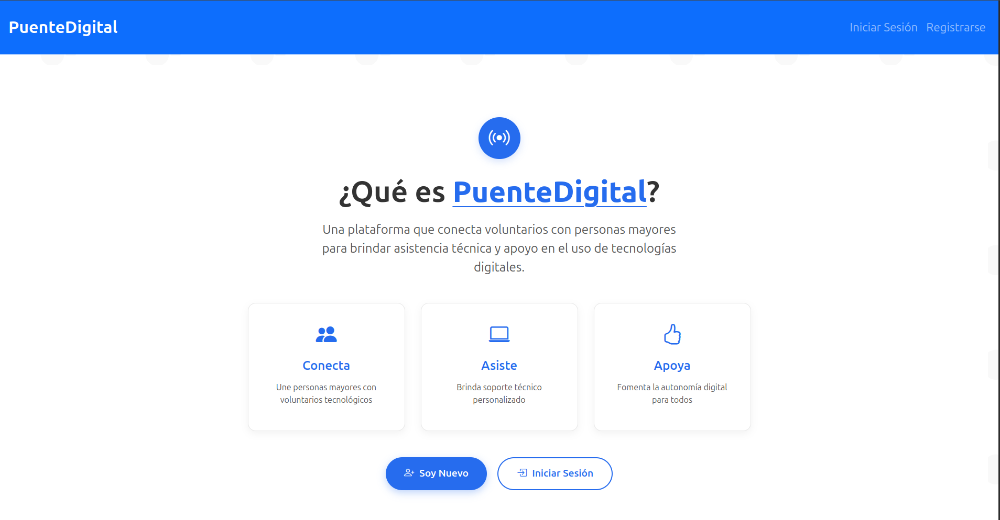

# PuenteDigital

**PuenteDigital** es una plataforma que conecta voluntarios con personas mayores para brindar asistencia técnica y apoyo en el uso de tecnologías digitales. Su objetivo es fomentar la inclusión digital y la autonomía de los adultos mayores a través del acompañamiento personalizado de voluntarios.

---

## 🖥️ Pantalla de Inicio

La pantalla de inicio presenta las funcionalidades principales de la plataforma:

- **Conecta**: Une personas mayores con voluntarios tecnológicos.
- **Asiste**: Brinda soporte técnico personalizado.
- **Apoya**: Fomenta la autonomía digital para todos.

---

## 🚀 Funcionalidades Principales

- 👥 **Conexión de Usuarios**: Facilita el contacto entre personas mayores y voluntarios.
- 💬 **Asistencia Técnica**: Soporte personalizado para resolver dudas o problemas tecnológicos.
- 👍 **Fomento de Autonomía**: Promueve el aprendizaje continuo y la independencia digital.

---

## 🛠️ Tecnologías Utilizadas

- **Frontend Móvil PuenteDigitalApp**: React Native
- **Frontend Web PuenteDigital-voluntario**: Vue.js
- **Servidor de Señalización** : Node.js
- **Backend**: Supabase y Node.js
- **Diseño**: HTML, CSS moderno y componentes accesibles.

---

## 📬 Contacto
Si tienes dudas o sugerencias, no dudes en crear un issue o contactarme a través del perfil de GitHub.

Gracias por visitar PuenteDigital ❤️

